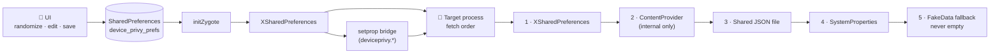

<div align="center">

# 🛡️ DevicePrivy

**One profile. Every scoped app. Zero real identifiers leak.**

*An LSPosed/Xposed module that serves a fully synthetic, internally-consistent device identity to scoped Android apps.*

[](https://github.com/0xhydraOp/DevicePrivy/actions/workflows/build.yml)
[](https://github.com/0xhydraOp/DevicePrivy/releases/latest)
[]()
[]()
[](LICENSE)

</div>

---

## ✨ Highlights

| | |
|---|---|
| 🎭 | **46+ identifiers, one identity** — telephony, network, locale, hardware and IDs all served from a single profile, so cross-checks agree |
| 🧬 | **Consistent by construction** — IMSI derives from MCC+MNC, geo is city-centred per carrier, phone lengths match numbering plans |
| 🔒 | **Field locks + history** — pin values across randomizations, restore any of the last 10 profiles, export/import JSON |
| 🎚️ | **8 hook toggles** — device, telephony, network, location, display, IDs, UA, stealth — each independently switchable |
| 💥 | **Crash-safe** — no `Unsafe`, no `hookAllMethods`, every hook individually guarded; never-empty fallback instead of leaking |
| 🌙 | **Modern UI** — system dark mode, search, inline validation, tap-to-copy |

> **Scope note.** DevicePrivy operates at the Java framework layer. It defeats ordinary apps and SDKs reading identity through public Android APIs. It does not — and cannot — spoof native-layer reads or hardware-backed attestation. See [Known limitations](#-known-limitations).

## Contents

- [How it works](#-how-it-works)
- [Spoofing coverage](#-spoofing-coverage)
- [App features](#-app-features)
- [Requirements](#-requirements)
- [Building](#-building)
- [Installation & usage](#-installation--usage)
- [Verifying it works](#-verifying-it-works)
- [Configuration reference](#-configuration-reference)
- [Project structure](#-project-structure)
- [Known limitations](#-known-limitations)
- [Troubleshooting](#-troubleshooting)
- [Signing & secrets](#-signing--secrets)
- [Versioning](#-versioning)
- [License](#-license)

## 🧠 How it works



**Design principles**

* 🌍 **One global profile, all scoped processes** — every scoped app sees the same identity. Deliberate; there are no per-app profiles.
* ✅ **Missing key = hook enabled** — toggles default to on, so older configs upgrade without losing coverage.
* 🛟 **Never-empty guarantee** — if every bridge fails, generated data is served rather than real values leaking.
* 🧯 **Crash-safe by construction** — one failing hook never takes down the rest.

## 🎭 Spoofing coverage

<details>
<summary><b>Click to expand the full hook matrix (9 categories)</b></summary>

| Category | What's spoofed |
|---|---|
| 📲 Device identity | `Build` fields (manufacturer → bootloader), `VERSION.RELEASE` / `SDK_INT` / `CODENAME` / `INCREMENTAL`, serial, fingerprint |
| 📞 Telephony / SIM | IMEI, MEID, **IMSI** (dedicated value — never a SIM-serial duplicate), ICCID, line number, SIM/network operator + name, MCC/MNC, country ISO; `PhoneStateListener` signal/cell callbacks neutralized |
| 📶 Network | Wi-Fi MAC / BSSID / SSID / IP, DHCP (gateway, DNS, netmask, server), Bluetooth MAC + name, `NetworkInterface` hardware address |
| 📍 Location | `LocationManager`, `Location` constructors (catches every path), Fused provider (pre-completed `Task`), locale + timezone |
| 🖥️ Display & GPU | Resolution, density/DPI, `GL_VENDOR` / `GL_RENDERER` from a randomized pool — no fixed device→GPU mapping |
| 🔋 Battery | Level scaled to manufacturer-specific scale (100 vs 1000) |
| 🪪 Android IDs | Android ID, GSF ID, AAID, MediaDrm device-unique ID |
| 🌐 User-Agent | `WebSettings`, `WebView.loadUrl` injection, `SystemProperties` + `System.getProperty("http.agent")`, `os.*` / JVM properties |
| 🥷 Anti-detection | `Class.forName` blocks for Xposed/LSPosed lookups (stack-trace whitelisted so LSPosed itself keeps working), `/proc/{self/maps,cpuinfo,meminfo}` filters, per-manufacturer sensor vendors, self-hiding from package lists |

</details>

**Identity data** — 42 Android 15 device profiles across 14 brands · 8 carrier profiles, each binding MCC/MNC ↔ locale ↔ timezone ↔ city-centred geo ↔ valid national number length · 15 resolution × 7 GPU hardware pools.

## 📱 App features

- ✏️ **Field editor** — every value viewable and editable, with search, inline validation (IMEI / IMSI / MAC / IP / geo / ID formats) and per-field keyboards
- 🔒 **Field locks** — pinned values survive profile randomization
- 🕘 **Profile history** — last 10 saved profiles with one-tap restore; export/import via clipboard JSON
- 🎚️ **Hook toggles** — eight category switches; take effect on target-app restart
- 💡 **Status badge** — live module-active detection, refreshed on resume
- 🌙 **Dark mode** — follows the system theme throughout

## 📋 Requirements

| Tool | Version |
|---|---|
| ☕ JDK | 17 (Temurin recommended) |
| 🤖 Android SDK | compileSdk 35 (`platforms;android-35`, `build-tools;35.0.0`) |
| 🐘 Gradle | 8.10.2 |
| 📲 Target device | Rooted, Android 15, LSPosed (Zygisk) |
| 📦 Libraries | Xposed API 82 (`compileOnly`), Kotlin 1.9.10 |

`minSdk 27` · `targetSdk 33` · R8/minification off (required — the module relies on reflection).

## 🔨 Building

With `JAVA_HOME` (JDK 17) and `ANDROID_HOME` set:

```powershell
cd DevicePrivacyLab
$env:ANDROID_HOME = "$env:LOCALAPPDATA\Android\Sdk"
C:\path\to\gradle-8.10.2\bin\gradle assembleDebug
```

> `build-debug.ps1` / `build-release.ps1` are wrappers expecting a `.tools/` layout (JDK, SDK, Gradle side by side) — read [Signing & secrets](#-signing--secrets) before building release.

| Command | Output |
|---|---|
| `gradle assembleDebug` | `app/build/outputs/apk/debug/app-debug.apk` |
| `gradle assembleRelease` | `app/build/outputs/apk/release/app-release.apk` (needs signing configured) |
| `gradle testDebugUnitTest` | unit tests — validators, generators, consistency rules |

✅ CI runs `assembleDebug` + unit tests on every push (`.github/workflows/build.yml`).

## 🚀 Installation & usage

1. Install LSPosed (Zygisk build) on a rooted device
2. Install the APK — `adb install app-debug.apk` for testing
3. In LSPosed Manager: **enable DevicePrivy and scope your target apps**
4. Open DevicePrivy → **Randomize** (or edit fields) → **Save**
5. Restart the target app (or Soft Reboot from the app — root required)

> ⚠️ After upgrading the APK, re-check the LSPosed scope — Android assigns a new path on update and LSPosed may need the module re-enabled.

## ✅ Verifying it works

1. Scope a device-info app in LSPosed
2. In DevicePrivy: randomize + save — note the IMEI / IMSI / Android ID shown
3. Open the scoped app — it must show **your** values, and IMSI must differ from the SIM serial
4. The status badge must read **MODULE ACTIVE**

## ⚙️ Configuration reference

All settings live in `device_privy_prefs` (`device_privy_history` holds snapshots, kept out of the hook data path):

| Key family | Example | Notes |
|---|---|---|
| Identity fields | `imei`, `imsi`, `android_id`, `mac_address`, … | Blank = fall back to generated data |
| `setting_debug_log` | `true` / `false` | Xposed log spam; default off |
| `setting_hide_self` | `true` / `false` | Hide module from package lists; default on |
| `hook_*` | `hook_telephony`, `hook_stealth`, … (8 keys) | Missing = enabled |
| `locked_fields` | `imei,android_id` | Preserved across randomization |

## 🗂️ Project structure

```
app/src/main/java/dev/codex/deviceprivy/
├── XposedEntry.kt      # lifecycle + data bridge (XSP → provider → file → sysprops → FakeData)
├── HooksDevice.kt      # Build fields, SystemProperties, UA, java.lang.System
├── HooksTelephony.kt   # TelephonyManager, PhoneStateListener
├── HooksNetwork.kt     # Wi-Fi, DHCP, NetworkInterface, Bluetooth
├── HooksIds.kt         # Settings, AAID, GSF, MediaDrm, ContentResolver
├── HooksLocation.kt    # LocationManager, Fused provider, constructors, locale/TZ
├── HooksHardware.kt    # Display, OpenGL, battery, sensors
├── HooksStealth.kt     # PackageManager hiding, Class.forName, /proc filters
├── FakeData.kt         # generators (Luhn IMEI, MCC+MNC IMSI, city geo, …)
├── DeviceProfiles.kt   # 42 device entries
├── FieldValidators.kt  # pure-Kotlin input rules (unit-tested)
├── DataProvider.kt     # internal ContentProvider fallback (not exported)
└── MainActivity.kt     # programmatic UI, no XML layouts
```

## 🚧 Known limitations

Platform constraints, not bugs:

- 🔌 **Native code is out of reach.** NDK syscalls (`getifaddrs`, raw `/proc` reads, `__system_property_get`) bypass Java-layer hooks entirely.
- 🔐 **Hardware attestation can't be faked.** Play Integrity / key-attestation verdicts are TEE-signed and server-verified; the module hides its presence but never forges a verdict.
- 🔢 **`Build.VERSION.SDK_INT`** is `static final int` — compiled-in constants in app bytecode can't be fully redirected.
- 📵 **`SystemProperties.set()` from zygote is blocked on Android 15** — bridged via `setprop` over `su`, with file/XSharedPreferences fallbacks.
- 🙈 System packages (`android`, `com.android.systemui`) are deliberately never hooked.

## 🩺 Troubleshooting

<details>
<summary><b>Click to expand</b></summary>

| Symptom | Likely cause | Fix |
|---|---|---|
| Badge reads INACTIVE | Module not enabled/scoped, or target needs restart | Re-enable + scope in LSPosed, restart target app |
| Scoped app shows real values | Stale LSPosed DB path after APK upgrade | Re-enable module, re-scope, soft reboot |
| Save blocked with "invalid fields" | A field fails format validation | Error text sits under the offending field; blank is always allowed |
| Randomize wiped a value | Field wasn't locked | Tap 🔓 next to the field before randomizing |
| Release build is unsigned | No `local.properties` / env credentials | See below |

</details>

## 🔑 Signing & secrets

Release credentials are **never committed**. Provide them via `local.properties` (gitignored — see `local.properties.example`) or the `RELEASE_STORE_PASSWORD` / `RELEASE_KEY_PASSWORD` / `RELEASE_KEY_ALIAS` environment variables. Without them, release builds simply come out unsigned; debug builds are unaffected.

## 🏷️ Versioning

`versionCode` + `versionName` in `app/build.gradle` are the source of truth; `CHANGELOG.md` records each release. Current: **v3.8.5-FIX** (versionCode 57).

## 📄 License

Custom license — personal use allowed; **forking, modifying, or redistributing requires prior written approval** from the repository owner. See [LICENSE](LICENSE). Use in compliance with applicable law and target apps' terms of service.

---

<div align="center">

*Built for testers who read logcat.* 📟

</div>
